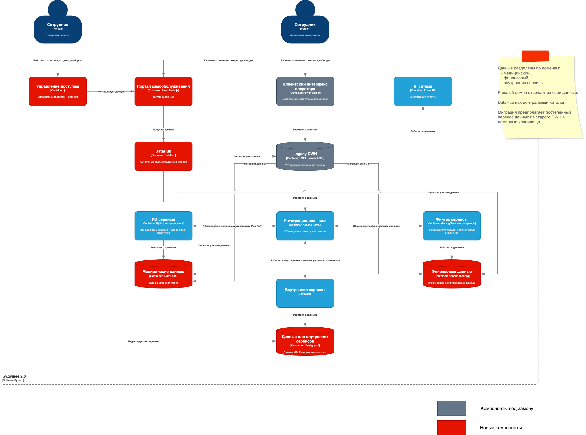

# Задание 1

## Диаграмма контейнеров в модели C4

 - (Исходник drawio)

## Проблемные места

В таблице ниже описаны ключевые проблемы, их влияние на бизнес и возможные последствия.

| Проблема | Описание | Последствия | Кого затрагивает |
| --- | --- | --- | --- |
| Медленная генерация отчетов | Сложные отчеты строятся часами из-за перегруженности DWH и большого количества преобразований данных. | Задержки в принятии решений, снижение операционной эффективности. | Руководство, аналитики, финансовая служба. |
| Жесткая связность данных | Все данные хранятся в одной системе (DWH), и добавление новых бизнес-направлений (финтех, ИИ) усложняет работу. | Новые проекты внедряются медленно, высокие затраты на доработки. | IT-отдел, продуктовые команды. |
| Устаревшие технологии | SQL Server 2008 не поддерживает современные методы аналитики, а Power Builder — устаревший интерфейс. | Риски безопасности, невозможность масштабирования, дорогая поддержка. | Вся компания (особенно клиники и финтех). |
| Нет самообслуживания в аналитике | Бизнес-пользователи зависят от IT-отдела при создании отчетов. | Долгое ожидание отчетов, негибкость в аналитике. | Менеджеры, маркетинг, финансы. |
| Сложность интеграции новых данных | Добавление данных от фармацевтических компаний и медоборудования требует ручной настройки. | Замедление вывода новых услуг на рынок. | Бизнес-развитие, ИИ-команда. |
| Риски безопасности и compliance | Медицинские и финансовые данные хранятся в одной системе без четкого разграничения доступа. | Возможные штрафы за нарушение GDPR, Ф3-152. | Юридический отдел, руководство. |
| Высокая нагрузка на DWH | Сотни терабайт данных обрабатываются в одной системе, что замедляет все процессы. | Увеличиваются затраты на серверы, падает отказоустойчивость. | IT-инфраструктура, бюджет. |
| Нет единой аналитической платформы | Данные разрознены, и каждый отдел строит отчеты по-своему. | Противоречивые данные, сложность консолидации отчетности. | Топ-менеджмент, акционеры. |

## Приоритизация проблем методом MoSCoW (Must, Should, Could, Won’t)  

| Категория | Проблема | Обоснование |
| --- | --- | --- |
| Must (Критично, без этого не обойтись) | Медленная генерация отчетов | Блокирует операционную деятельность, влияет на принятие решений. |
|  | Риски безопасности и compliance | Нарушение GDPR/ФЗ-152 приведет к штрафам и репутационным потерям. |
|  | Устаревшие технологии (SQL Server 2008, Power Builder) | Угроза безопасности, высокая стоимость поддержки. |
| Should (Важно, но можно временно терпеть) | Жесткая связность данных | Замедляет развитие новых направлений (финтех, ИИ). |
|  | Высокая нагрузка на DWH | Увеличивает затраты на инфраструктуру. |
|  | Нет самообслуживания в аналитике | Снижает эффективность бизнес-пользователей. |
| Could (Желательно, но не срочно) | Сложность интеграции новых данных | Влияет на скорость вывода новых продуктов. |
|  | Нет единой аналитической платформы | Усложняет консолидацию отчетности. |
| Won’t (Не будем решать сейчас) | – | Все перечисленные проблемы требуют решения, но некоторые могут быть отложены. |