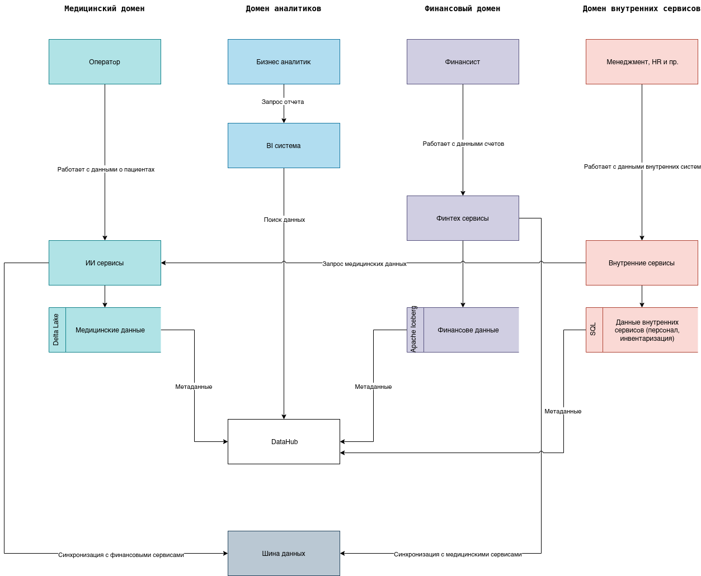

# Задание 2

## Разделение на домены

Выделяю следующие домены:

 - Медицинский домен
 - Финансовый домен
 - Домен внутренних сервисов (HR, управление)
 - Домен аналитиков

## Data Flow Diagram

 - [Исходники drawio](./c4_containers_domains.drawio)

## Аргументация

Выделение доменов обусловлено прежде всего бизнес требованиями - развивать ключевые сервисы:
 
 - медицинские
 - финансовые
 - персонал и инвентаризация
 - формировать аналитику

Было:

 - Все данные хранятся в едином DWH
    - создает зависимости между командами
    - данные не консистентны
    - сложные и долгие процессы по обновлению (получению актуальных) данных
    - нагрузка на DWH

 - Сложность масштабирования, добавления новых бизнесов

Стало:

**Гибкость**

 - В каждом домене команда выбирает как и где хранить данные
    - Технологии
    - Политики управления (API)
    - Политики доступа

**Влияние команд друг на друга**

 - Команды не испытывает влияние смежных команд на работу с данными
    - ИИ команда может работать с данными непосредственно 

**Безопасность**

 - Data Flow процесс стал прозрачным 
 - Организация доступа стала прозрачнее - выделили границы

**Производительность**

 - Отчеты строятся быстрее - разгрузили DWH
 - Команды оптимизируют данные независимо (а значит оперативнее и проще)
 - Нет посредников при передаче данных между доменами
