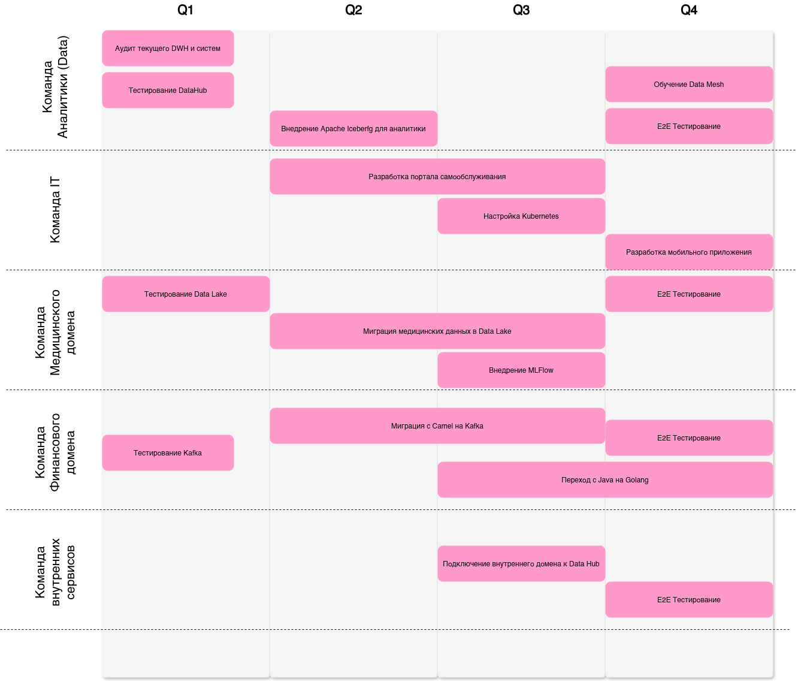

# Задание 3

## Технический радар

- Adopt - устоявшиеся технологии.
- Trial - пробные технологии или технологии на подъёме
- Asset - оценочные технологии
- Hold - технологии, которые больше нежелательны

### Языки программирования и фреймворки

| Технология  | Статус | Комментарий |
|---|---|---|
| Python | Adopt | Стандарт для AI/ML |
| Golang | Adopt | Для финтех-сервисов |
| Java (Spring Boot) | Trial | Используется в legacy-финтехе. Планируется замена на Golang |
| React | Adopt | Базовый фреймворк для нового BI-портала и клиентских интерфейсов |
| FastAPI | Trial | Тестируется для медицинских API |
| Power Builder | Hold | Устаревший легаси-инструмент. Постепенная миграция на React + Golang/Python |

### Инструменты

| Технология | Статус | Комментарий |
|---|---|---|
| PostgreSQL | Adopt | Основная БД для HR и инвентаризации. Бесплатна и надежна |
| Delta Lake | Trial | Формат хранения для медицинских данных |
| Apache Iceberg  | Asset | Тестируется для аналитики в финтехе |
| Kafka | Trial | Основная шина событий для интеграции доменов |
| DataHub | Trial | Пилотируется как каталог метаданных |
| Apache Camel | Hold | Устаревшая шина. Планируется замена на Kafka/gRPC |

### Платформы

| Технология | Статус | Комментарий |
|---|---|---|
| Kubernetes | Trial | Тестируется для оркестрации микросервисов (финтех, ИИ) |
| Java | Hold | Используется в legacy-системах. Постепенный отказ в пользу нативных решений |
| Android/iOS | Asset | Потенциальное развитие мобильных приложений для пациентов |

### Методы

| Технология | Статус | Комментарий |
|---|---|---|
| Data Mesh | Trial | Пилотируется для разделения данных по доменам |
| Микросервисы | Adopt | Основная архитектура для финтеха и новых сервисов |
| ETL (Apache Airflow) | Hold | Устаревший подход. Замена на ELT (Apache Iceberg) |
| MLOps (MLflow) | Asset | Планируется внедрение для управления ИИ-моделями |

### Суммарно

1. Adopt: Python, React, PostgreSQL.
2. Trial: DataHub, Apache Iceberg, FastAPI, Kafka
3. Asset: MLOps, мобильные платформы.
4. Hold: Power Builder, Apache Camel, Java.

## Дорожная карта

 - [Исходник дорожной карты drawio](./roadmap.drawio)

Q1 - Подготовка:

Обоснование: необходимо определить границы доменов для детализации целевой архитектуры.
Для неизученных продуктов - начать процесс пилотирования (Kafka, )

Результат:
 - Определены границы доменов (медицина, финтех, внутренние сервисы)
 - Запущены пилоты ключевых технологий (Kafka, DataHub).
 - Сформированы рабочие группы

Q2 - Миграция данных:

 - Медицинские данные перенесены в Delta Lake
 - DataHub подключен к медицинскому и финтех-доменам.
 - Шина Camel заменена на Kafka
 - Запущен BI-портал на React

Q3 - Data Hub:

 - Все домены работают на обновленном стеке, миграция продолжается.
 - DataHub становится единственным источником истины о данных\
 - Полный отказ от SQL Server 2008 и Power Builder
 - Запущены Data-пайплайны (автоматизация MLOps)

Q4 - Тестирование:

 - Автоматизированные пайплайны (ELT)
 - Мобильные приложения для клиентов

Домены поэтапно подключаются к DataHub.

